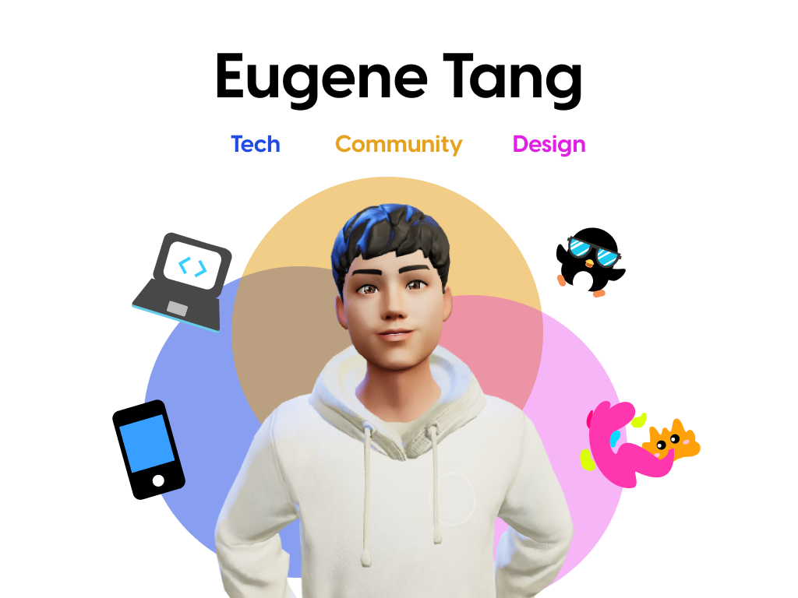

# Hi there, I am Eugene! 👋💻

  

## About Me
I am an aspiring software engineer with a genuine passion for building user-centric products. My primary focus is on creating visually appealing, intuitive-to-use, and highly functional interfaces. Thus, I am constantly exploring the latest technologies and staying updated with emerging UX design trends.

## Guiding Philosophy

I firmly believe that technology is a powerful tool that has the potential to greatly improve people's lives. It is this belief that drives me to continually seek out problems that can be solved through innovative technological solutions. My ultimate goal is to create a positive and meaningful impact on others by leveraging the power of technology for the greater good. 🥰

## Fun Facts
In addition to my software engineering pursuits, I also enjoy utilising my free time to do simple UI mockups and graphic design. This creative outlet allows me to express my artistic side and provides a refreshing break from coding. Feel free to view some of my designs on [Dribbble](https://dribbble.com/eugenetangkj).

